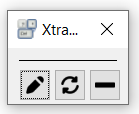
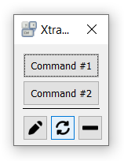

# About

This application is just a set of configurable buttons and corrensponding settings:

- a caption,
- an optional shortcut,
- an attached command (file or script), which can be executed by the default application.

These settings are described in the special file and can be updated from the application.

# Interface

#### No commands are set:



#### Two commands are set:



# Control Buttons

-  - edit settings file (__Ctrl+E__),
-  - update settings (__Ctrl+R__),
-  - minimize window (__Ctrl+M__).

# Settings File

```
<config>
  <vars>
    <var name="VAR_FROM_VARS" val="someValue" />
  </vars>
  <cmds>
    <cmd name="Button #1" val="path/to/file" />
    <cmd name="Button #2" val="${SYS_VAR}/file" />
    <cmd name="Button #3" val="${VAR_FROM_VARS}/file" />
    <cmd name="Use &amp;Shortcut" val="some_cmd" />
  </cmds>
</config>
```

## Section __config__

Root section.

### Section __vars__

In this section custom variables can be set.

#### Tag __var__

This tag describes a custom variable. Attributes:

- __name__ describes a variable name,
- __val__ describes a variable value, for example, a path.

### Section __cmds__

In this section custom commands can be set.

#### Tag __cmd__

This tag describes a custom command. Attributes:

- __name__ describes a button name,
- __val__ describes a command path, for example, for a file or script.

In the __name__ attribute it is possible to set hot keys. To set a combination, it is necessary to write `&amp;` before a chosen letter. For example, for the command `<cmd name="Use &amp;Shortcut" val="some_cmd" />` the __Alt+S__ is set.
